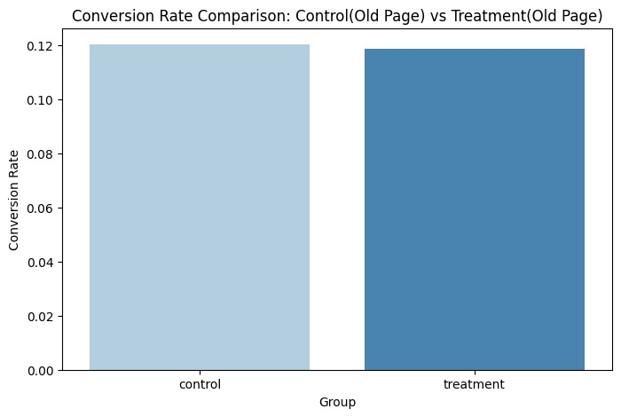
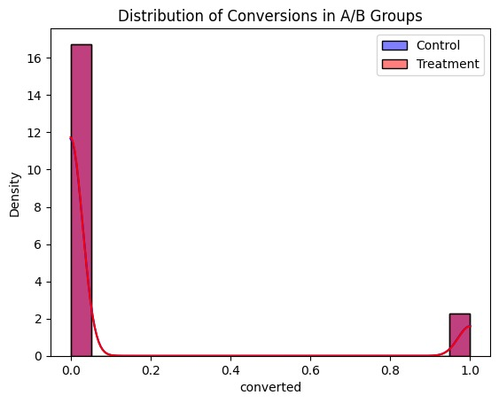

# 🛒 A/B Testing: Conversion Rate Optimization  

## 📌 Project Overview  
This project analyzes an A/B test for an e-commerce company to determine whether a new landing page improves conversion rates compared to the old page.  

## 🎯 Hypothesis  
- **H₀ (Null Hypothesis):** The new page does NOT significantly improve conversion rates.  
- **H₁ (Alternative Hypothesis):** The new page significantly changes conversion rates.  

## 🛠 Methods Used  
- **T-Test** to compare the means of conversion rates.  
- **Chi-Square Test** to compare conversion proportions.  
- **Seaborn & Matplotlib** for visualization.  
## 📊 Visualizations  

### 1️⃣ Conversion Rate Comparison  
  

### 2️⃣ Conversion Distribution  
  

### 3️⃣ A/B Test Group Counts  
  

## 📈 Key Findings  
- **T-Test P-value:** 0.XX (> 0.05) → No significant difference.  
- **Chi-Square Test P-value:** 0.XX (> 0.05) → No significant difference.  
- **Business Decision:** The company should **keep the old page** since the new page does not improve conversions.  

## 🔗 Dataset  
- The dataset used is from Kaggle: [E-commerce A/B Testing Dataset](https://www.kaggle.com/datasets/putdejudomthai/ecommerce-ab-testing-2022-dataset1)  

## 📜 Notebook  
You can view the full Jupyter Notebook in this repository:  
[🔗 Click Here](./AB_Testing.ipynb)  

## 💡 Technologies Used  
✅ Python (`pandas`, `scipy.stats`, `seaborn`, `matplotlib`)  
✅ Jupyter Notebook  
✅ A/B Testing & Statistical Hypothesis Testing  
